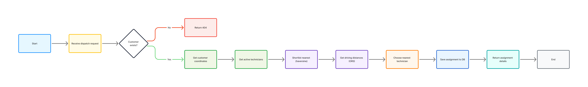

# Technician Dispatch API

**Asynchronous FastAPI service for intelligent field technician dispatching**



## Overview

The Technician Dispatch API provides a production-ready foundation to automatically assign the nearest available field technician to a customer service request. The service balances speed and accuracy by combining a lightweight geographic prefilter (Haversine) with precise driving-distance calculations from OpenRouteService (ORS). Assignments are persisted to PostgreSQL and the service is designed using asynchronous primitives for high throughput and resilience.

---

## Architecture & Flow

The following flowchart illustrates the end-to-end dispatch process implemented by the service. It shows the decision points and the sequence of operations from receiving a dispatch request through persisting the final assignment.


---

## Key design principles

- Accuracy where it matters: Local Haversine prefilter reduces the candidate set quickly; ORS provides accurate driving distances for the shortlist.
- Scalable async design: asyncpg connection pooling and httpx async HTTP client enable concurrent routing calls and low-latency behavior under load.
- Observability & reliability: Health checks, retry policies (tenacity), and sensible timeouts guard against external API failures.
- Extensible schema: Assignments table preserves history to enable auditing and analytics.

---

## Quickstart (local)

1. Copy `.env.example` to `.env` and set the required values (see `.env.example`).
2. Ensure PostgreSQL is running and that a database exists with the name in `DB_NAME`.
3. Install dependencies and run:
```bash
python -m venv .venv
source .venv/bin/activate
pip install -r requirements.txt
export DB_PASSWORD=your_db_password
export OPENROUTE_API_KEY=your_openrouteservice_key
uvicorn app:app --reload --host 0.0.0.0 --port 8000
```

### Run with Docker
```bash
docker build -t technician-dispatch-api .
docker run -e DB_PASSWORD=... -e OPENROUTE_API_KEY=... -p 8000:8000 technician-dispatch-api
```

---

## Configuration (environment variables)

Required:
- DB_PASSWORD — PostgreSQL user password.
- OPENROUTE_API_KEY — API key for OpenRouteService.

Optional:
- DB_HOST, DB_PORT, DB_NAME, DB_USER — DB connection details.
- OPENROUTER_API_KEY — Optional LLM key if integrating the LLM flow.

See `.env.example` for a complete template.

---

## Database schema (summary)

- public.customers (customerid, latitude, longitude, ... )
- public.technicians (technicianid, latitude, longitude, is_active, ... )
- public.assignments (id, cust_id, tech_id, distance_km, assigned_at) — preserves assignment history.

---

## API Endpoints (summary)

- POST /dispatch/{cust_id} — compute and persist the nearest technician assignment for the given customer id. Returns the assignment object.
- GET /assignments — list recent assignments.
- GET /healthz — light-weight health check showing DB connectivity status.

---

## Operational notes & next steps

- For large fleets, consider using the ORS Matrix endpoint to compute multi-point distance matrices efficiently.
- Add request / api rate limiting to protect ORS quotas and implement exponential backoff and circuit-breaker patterns.
- Integrate metrics (Prometheus) and distributed tracing for production observability.
- Add role-based access and authentication (JWT or API gateway) before exposing the API externally.

---

## Contributing & Support

Please refer to CONTRIBUTING.md for how to contribute, and CODE_OF_CONDUCT.md for community guidelines. Open issues and pull requests are welcome.

---

**License:** MIT — see LICENSE (Copyright © 2025 Floyd Steev Santhmayer)